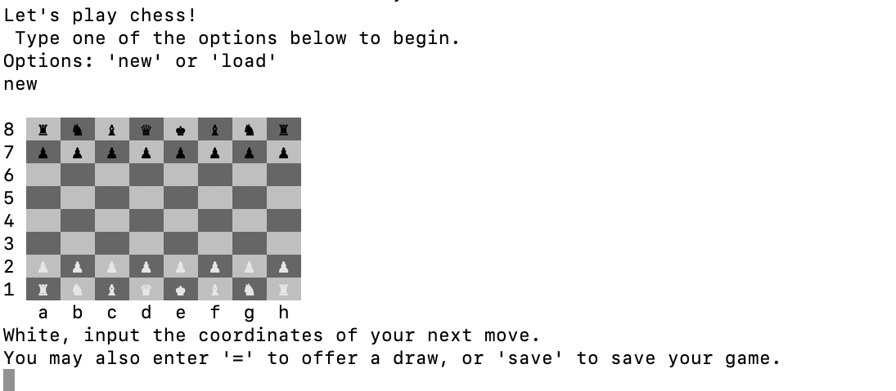

# Chess



This program is a version of the popular game chess and is meant to be played by two human players
on the command line. It was created as part of the curriculum at [The Odin Project](https://www.theodinproject.com/).

## Table of Contents

[I. Motivation](#motivation)  
[II. Installation/Getting Started](#installationgetting-started)  
[III. Usage](#usage)  
[IV. Features](#features)  
[V. Known Issues/Future Development](#known-issuesfuture-development)

## Motivation

My goal in creating this program was to gain experience building a large and complex program with many different classes and complicated rules and functionality. This project was also an opportunity to exercise my knowledge in Ruby and reinforced the concepts I have been learning about the language.I was also focused on creating thorough tests and maintaining somewhat clean code throughout the program.

## Installation/Getting Started

Prerequisites:  
Ruby 3.1.2

The easiest way to begin playing is to use the live Replit. Click Run, and the game will begin.

You can also fork the repo and begin playing in the command line. Make sure you have the prerequisites listed above. Use the commands below:

```console
clone https://github.com/mjande/chess
cd chess
bundle install
ruby lib/main.rb
```

When opening the game for the first time, you will be asked whether you want to start a new a game or load a previous one. Type new to begin a new game.

## Usage

The rules of chess are complex, and for the most part are outside the scope of these instructions. A helpful and thorough explaination of these rules can be found [here](http://www.chessvariants.org/d.chess/chess.html).

After starting a new game, the player playing white will be prompted to enter their first move.

Inputs will need to follow conventions of algrebraic chess notation. Most moves will start with a letter signifying one of the pieces, followed by a column (file) and row(rank). An example would be 'Ra3', which would indicate moving the player's Rook to third row of the first column. In the case of pawns, only the row and column is needed (example: 'b4').

See [Algebraic Notation](https://en.wikipedia.org/wiki/Algebraic_notation_(chess)) on Wikipedia for more details on this system, and consult the Move Inputs section of Features below for more information on how this system works in this program.

Players will take turns inputting desired moves, and after each turn an updated board will be displayed. Players will proceed in this fashion until one player is forced into checkmate or one of the draw conditions is met (see Features for more information).

### Tests

To run all tests for this program, use the command below in the root directory:

`rspec`

To run an individual test, use the command below, inserting the test you would like to run:

`rspec spec/****.rb`

or

`rspec spec/****/****.rb`

## Features

### Move Inputs

As mentioned above, this program uses algebraic chess notation to figure out what move the player desires. In this notation, all pieces except pawns are represented by a capitalized letter (K: King, Q: Queen, B: Bishop, N: Knight, R: rook) The program can handle several variations used in algebraic notation:

- Standard
  - Piece followed by column followed by row ('Ra3')
- Pawn
  - Column followed by row ('b4')
- Pawn Promotion
  - Column followed by row followed by piece you are promoting your pawn to ('c8Q')
- Disambiguating Moves
  - Originating column and/or originating row followed by piece followed by column and row ('Rah6' or 'R3h6')
- Disambiguating Moves(Pawn)
  - Originating column followed by row and column ('cd6')
- Capture
  - Piece followed by the letter x, followed by column and row ('Nxc6')
- Capture (Pawn)
  - Originating column followed by the letter x, followed by column and row ('gxh6')
- Castling
  - 'O-O' for kingside castling or 'O-O-O' for queenside castling
- Check
  - Standard notation followed by a cross ('Nf3+')
- Checkmate
  - Standard notation followed by two crosses ('Nf3++')
- Other Inputs
  - '=' to ask for a draw or 'save' to save the game

With a few exceptions (castling or disambiguating moves), players can always use the standard notation to indicate a move, even if another variant of notation could be used.

### Check

When any opposing piece is able to take the king with its next move. When the king is threatened with check, the next player will be informed that they must move their king to safety. Only moves which prevent check will be allowed.

### Checkmate

If a player's king is placed in check and has no available moves to leave check, they are in check and the game is over. A message will be displayed indicating the winner.

### Draw

The program handles several but not all draw conditions. The implemented draw conditions include:

-Mutual Agreement
  If one player requests a draw, the other player can either accept or reject the offer. Acceptance will end the game; otherwise, play will continue.
-Stalemate
  If a player has no possible moves but is not in check, the game ends in a stalemate with no winner.
-Dead Position
  Several different combinations of remaining pieces can result in situation where neither player will be able to force checkmate without serious misplay. If any of these situations occur, the game ends in a draw.
-Threefold Repetition
  If both players engage in repeated moves which lead to a similar board layout on at least three occasions, the game ends in a draw.
-50 moves since capture
  -If there are 50 or more moves without capturing any pieces, the game ends in a draw.

### Save/Load

The program also features the ability to save a game and load a previous one at startup. Players can save their game at any time by typing 'save' instead of their next move. 

To load a saved game, players should type 'load' up starting the program. At this time, players can only save one game at a time.

## Known Issues/Future Development

Known Issues

-Only one save is allowed at a time, and there is currently no way to erase a save without overwriting it.
-The board cloning involved in checking for a potential check when evaluating possible moves is quite slow, and this method should be optimized if any improvements are made.
-Most classes rely on the board as a dependency, making large-scale changes to the underlying code diffciult.

If more time is spent developing this particular program, a few additional features may include:

-Multiple save files
-More complex game set-up with customization of pieces
-A log of previous moves that can be accessed during or after the game
